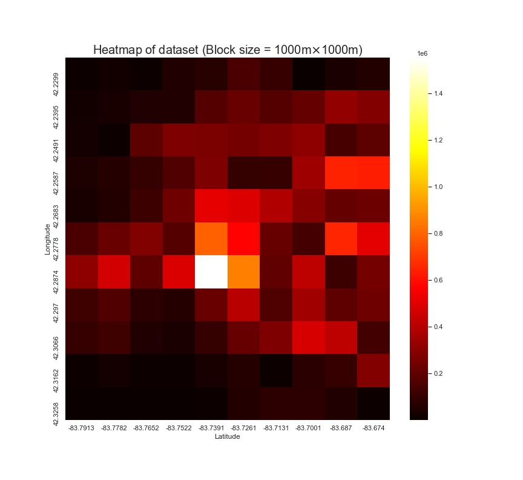

# VED

This repository is for 

Current state:

> We made a visualization of the distribution of the original VED dataset (in total 54 .csv files). Heatmaps are shown as follows, different sized blocks are shown (in meters).

    

    

    

> In this way, we can visualize an approximated distribution of sampled data on a map. 